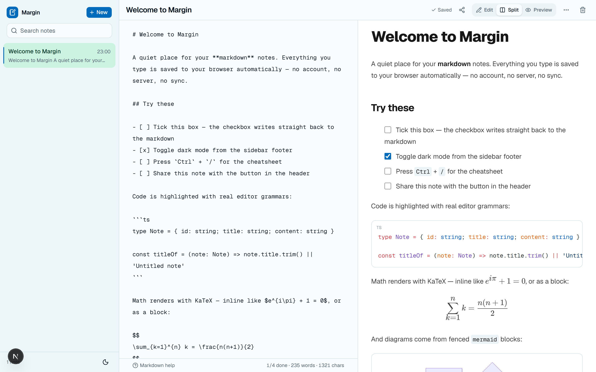
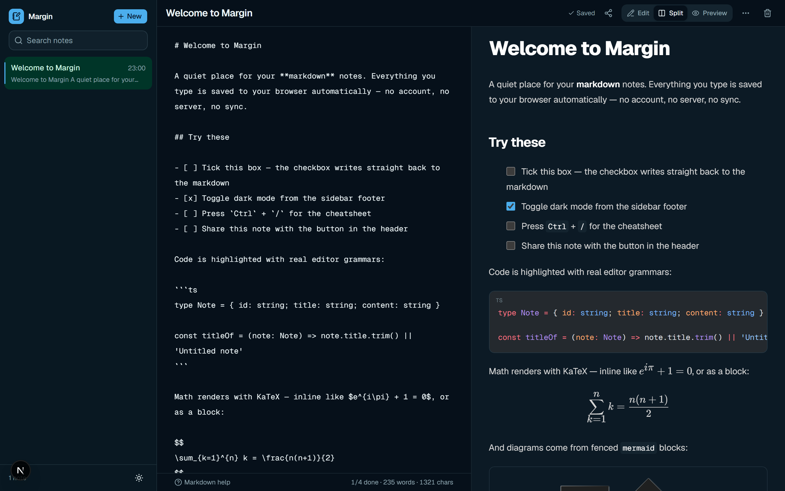
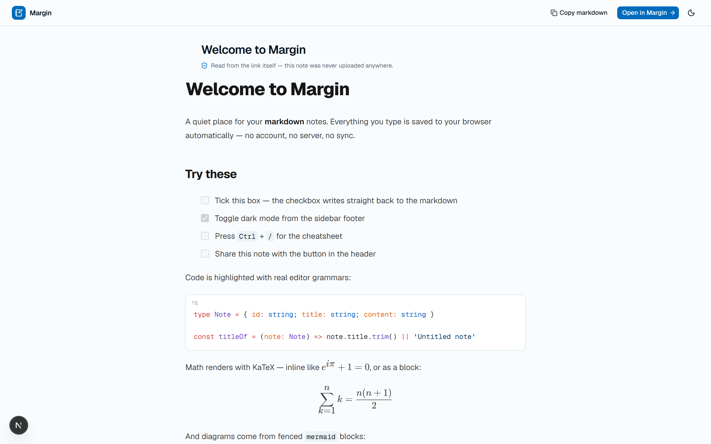

# Margin

A local-first markdown workspace. Write on the left, see it rendered on the right — with real syntax highlighting, LaTeX math, Mermaid diagrams, and checkboxes you can actually click.

Everything lives in your browser. There is no account, no database, and no server that ever sees a note — including the ones you share.



---

## What makes it interesting

**Sharing with no backend.** The share button packs a note into the URL *fragment* — the part after `#`. Browsers never transmit a fragment to the server, so a shared link carries the whole note with it and no copy exists anywhere else. No upload, no storage, no expiry, no link-shortener logging your text. Compression is the browser's own `CompressionStream('deflate-raw')`, so it costs zero dependencies and typically shrinks a note by 60–80%.

The end-to-end test asserts this property directly: after opening a share link, no network request made by the page contains the payload.

**Checkboxes that write back.** GFM renders `- [ ]` task lists as *disabled* inputs. Here they're live — clicking one rewrites that line in the markdown source. Because the preview renders deferred content, a click can carry a line number that has already moved; `toggleTaskAtLine` verifies the target really is a task item and no-ops otherwise, so a stale click is harmless rather than corrupting a different line.

**Code that doesn't re-highlight on theme change.** Shiki emits both themes at once as CSS variables, so switching light/dark is a pure CSS swap — no flash, no second pass. Shiki itself is imported on first use and loads one grammar at a time, so a note with a single `ts` fence never pays for the other eighty languages.



---

## Features

| | |
| --- | --- |
| **Editor** | Live preview, three view modes, multi-line `Tab` / `Shift+Tab` indent that preserves native undo, word/char/task counts, markdown cheatsheet |
| **Rendering** | GFM, Shiki syntax highlighting, KaTeX math, Mermaid diagrams, heading anchors, per-block copy buttons |
| **Notes** | Full-text search, autosave with real failure reporting, remembers your note and layout across reloads |
| **Portability** | Export one note as `.md`, all notes as `.zip`, or a `.json` backup; import by file picker or drag-and-drop |
| **Sharing** | Server-free share links, a read-only reader page, "Open in Margin" to import |
| **Platform** | Installable PWA with offline support, print / Save-as-PDF stylesheet, light & dark, keyboard and screen-reader support |



---

## Keyboard

| Shortcut | Action |
| --- | --- |
| `Tab` / `Shift`+`Tab` | Indent / outdent the selected lines |
| `Ctrl`/`Cmd` + `/` | Toggle the markdown cheatsheet |
| `Esc` | Close the cheatsheet, clear search, or close the sidebar |
| `Ctrl`/`Cmd` + `P` | Print, or save the rendered note as a PDF |

---

## Getting started

```bash
npm install
npm run dev
```

Then open <http://localhost:3000>.

| Script | What it does |
| --- | --- |
| `npm run dev` | Development server |
| `npm run build` / `npm start` | Production build and serve |
| `npm run typecheck` | `tsc --noEmit` |
| `npm run lint` | ESLint |
| `npm test` | Vitest unit tests |
| `npm run test:e2e` | Playwright end-to-end tests |

> Use `localhost`, not `127.0.0.1` — Next's dev server rejects asset requests from an untrusted host with a 403 and the page comes up blank.

---

## Architecture

Next.js 16 (App Router) · React 19 · TypeScript (strict) · Tailwind v4 · Base UI.

```
app/
  page.tsx            Loads the app client-only (notes live in localStorage)
  read/               The shared-note reader; decodes from location.hash
  manifest.ts         PWA manifest
  error.tsx           Error boundaries
lib/
  notes.ts            Note type, storage, validation
  share.ts            Fragment encode/decode (deflate + base64url)
  export.ts           Markdown / zip / JSON export and import
  markdown-edit.ts    Indent, outdent, minimal-diff — pure, unit-tested
  markdown-tasks.ts   Checkbox toggling — pure, unit-tested
  highlighter.ts      Lazy Shiki singleton
  prefs.ts            Persisted UI preferences
hooks/use-notes.ts    The entire data layer
components/notes/     The app shell
```

A few decisions worth explaining:

- **Logic lives in `lib/` as pure functions.** Encoding, task toggling, indentation, and export are all plain data-in/data-out, which is why 131 unit tests cover them without a DOM. The components are left thin enough that Playwright is the right tool for the rest.
- **`useNotes()`'s return shape is the seam.** Swapping localStorage for IndexedDB or a server would touch `lib/notes.ts` and one effect, and nothing else.
- **Syntax highlighting is not a rehype plugin.** `react-markdown` runs its pipeline synchronously and Shiki's rehype integration is async. Doing it inside the code-block component instead keeps the pipeline sync *and* keeps Shiki out of the initial load.
- **The service worker is hand-written** (~60 lines). `next-pwa` is unmaintained for the App Router, and network-first navigation with cache-first static assets is short enough to read in one sitting.

### Storage

Notes are a single JSON array under `markdown-notes:v1`, debounced 600 ms and flushed on `pagehide`. Writes report failure, so a full quota or Safari private mode shows **Not saved** rather than a checkmark over a silent data loss.

The known ceiling is localStorage's ~5 MB. Moving to IndexedDB is the next step, along with cross-tab sync — today two open tabs will overwrite each other.

---

## Testing

131 Vitest unit tests across the pure modules, plus 10 Playwright journeys covering the welcome note's highlighting/math/diagrams, autosave and reload persistence, checkbox write-back, multi-line indent, the share round-trip and its privacy property, corrupt-link handling, view-mode persistence, markdown export, failed-save reporting, and the mobile drawer's tab order.

```bash
npm test && npm run test:e2e
```

---

## License

MIT
